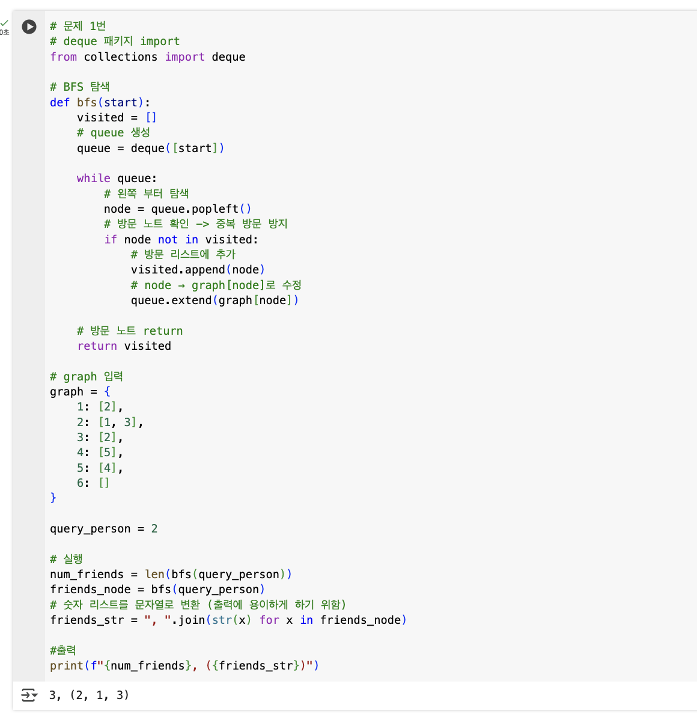

## 🔷 선택 알고리즘 : BFS

## 🔹 선택 이유 및 장단점 비교

가까운 친구부터 차례로 방문하는 것이 더 빠르고 효율적이라고 생각하여 **BFS 알고리즘**을 선택하였다.  
BFS는 방문한 노드를 체크하여 **중복 방문을 방지**하므로 무한 루프에 빠지지 않을 가능성이 있다.  
DFS에 비해 **가까운 노드부터 우선 탐색**을 하므로 **직접 연결된 것을 파악하는 데 활용하기 쉽다**고 생각하여 BFS가 적합하다고 판단하였다.

## 🔹 탐색 흐름
bfs 알고리즘에서 2로 시작하는 노드를 찾고 연결된 노드들을 탐색한다. 방문 리스트를 통해 2와 연결된 노드들을 출력한다.

## 🔹 구현 코드 및 실행 결과 캡처

