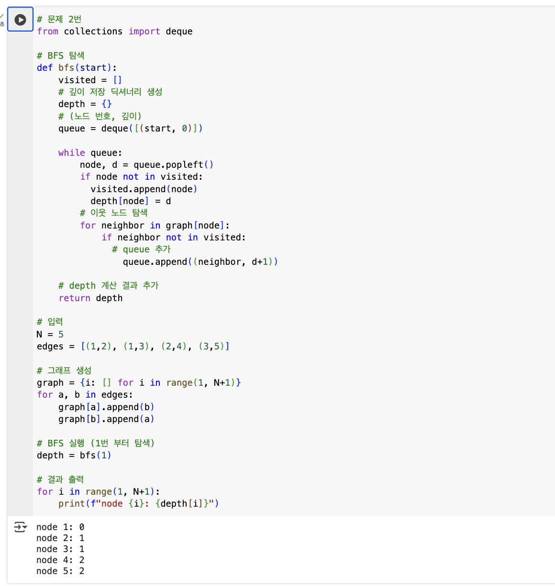

## 🔷 선택 알고리즘 : BFS

## 🔹 선택 이유 및 장단점 비교
트리에서 루트노드부터 모든 노드까지의 깊이를 구해야하는 문제이며 BFS는 깊이별로 탐색이 이루어지므로 각 노드를 처음 방문하는 시점의 깊이를 기록하기에 편리하다고 생각하였다.
DFS도 가능하지만, DFS는 각 노드의 깊이를 따로 관리해야하기 때문에 조금 더 복잡해질 것이라고 생각했다.

## 🔹 실행 흐름
기본 BFS 알고리즘에 깊이 정보를 저장하는 딕셔너리를 생성하여 노드별 깊이 까지 저장한 후 출력하도록 하였다.

## 🔹 구현 코드 및 실행 결과 캡처

