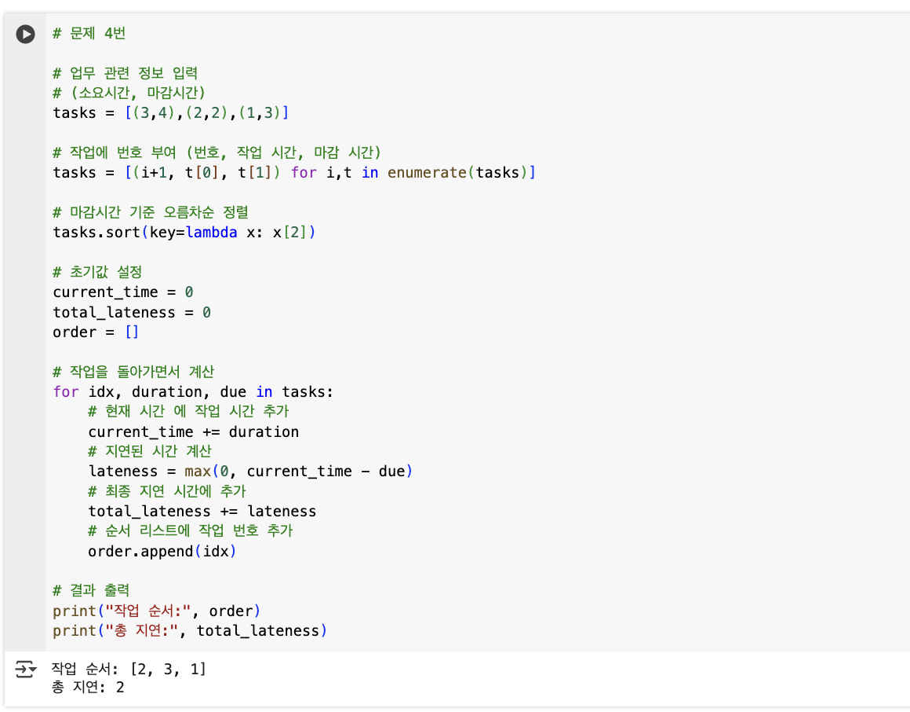

## 🔷 선택 알고리즘 : 탐욕적 알고리즘

## 🔹 정렬 기준
마감시간을 기준으로 오름차순 정렬하여 기준을 선택함. 
마감시간이 빠른 작업부터 처리하면 총 지연 시간을 최소화하할 수 있다고 생각했다.

## 🔹 알고리즘 흐름
1) 입력 작업에 번호를 부여하여 저장
2) 마감 시간 기준으로 정렬
3) 현재 시간을 업데이트 하고
4) 지연 시간을 계산하여 작업 순서를 기록한다.
5) 
## 🔹 구현 코드 및 실행 결과 캡처

