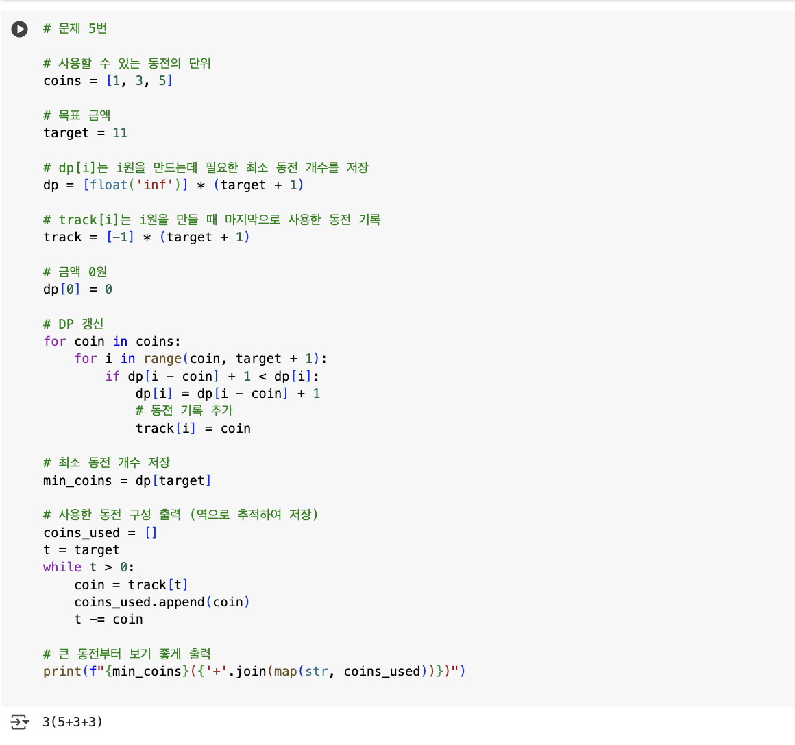

## 🔷 선택 알고리즘 : DP

## 🔹 DP 점화식 설정 및 설명

dp[i]: 금액 i원을 만드는 최소 동전 개수
점화식 : dp[i]=min(dp[i],dp[i−coin]+1)

금액 i를 만들기 위해 현재 고려중인 coin을 사용하는 경우에는 i - coin원을 만드는 최소 동전 수 + 현재 사용한 동전 1개이다. 
기존 dp[i] 값과 비교하여 더 작은 값으로 업데이트 한다. 
dp[0]은 0개로 설정하고 나머지는 무한대로 설정하여 초기화시키낟.
track[i] 배열을 사용하여 금액 i원을 만들 때 마지막으로 사용한 동전을 기록하여 최종적으로 사용한 동전 구성까지 추적한다.
## 🔹 알고리즘 흐름
1) dp, track 초기화
2) 각 동전 coin에 대해 target까지 반복, dp[i]갱신 및 track[i] 갱신
3) dp 테이블 완성 후 역추적하여 사용한 동전 찾기

## 🔹 구현 코드 및 실행 결과 캡처

