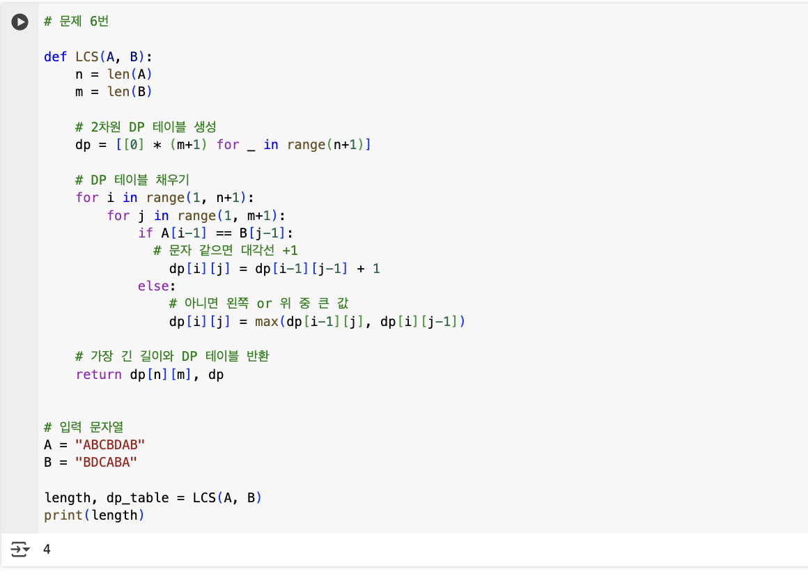

## 🔷 선택 알고리즘 : LCS

## 🔹 점화식 및 설정값 설명
두 문자가 같으면, 공통 부분 수열 길이에 1을 더하고 다르면 이전 상태 중 최대값을 선택한다.

dp[i][j] = A 문자열의 앞 i글자, B 문자열의 앞 j글자의 LCS 길이
문자가 같을 경우 : dp[i-1][j-1]+1
문자가 다를 경우 : max(dp[i-1][j], dp[i][j-1])

## 🔹 알고리즘 흐름
1) DP 테이블 초기화
2) DP 테이블 채우기
3) DP 테이블 역추적하여 LCS 문자열 구성

## 🔹 구현 코드 및 실행 결과 캡처

